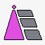

Welcome to my Github!
-------------
Hi there! I'm Ana Iranzo, a passionate full-stack developer with a love for crafting web applications that are not only functional but also user-friendly. My journey in the world of technology has been an exciting one, and I'm eager to share some of my projects and experiences with you.

### About Me

I have a diverse background that encompasses both front-end and back-end development. I'm always exploring new technologies and looking for ways to improve my skills. When I'm not coding, you'll find me skating, climbing, or simply enjoying a movie with my cats."

* 🌍 I'm based in Madrid
* ✉️ You can contact me at [aeiranzom@gmail.com](mailto:aeiranzom@gmail.com)
* 🌱 I’m currently learning testing with Vitest.

## Featured Projects

### Project 1: E-Commerce Store

- Description: Built a fully functional e-commerce website with product listings, product sorting, shopping cart.
- Technologies Used: React.js, Node.js, Express.js, MongoDB.
- [View Project](https://github.com/AnaIranzo/online_shop)

### Project 2: E-Learnig Platform

- Description: Developed an E-learning platform with a multidisciplinary team.
- Technologies Used: React.js, Node.js, Redux, Sass, PostgreSQL.
- [View Project](https://github.com/AnaIranzo/eLearning_platform)

### Project 3: Movie App

- Description: Developed a movie website with user authentication, two roles, movie listings, movie CRUD. 
- Technologies Used: Node.js, Express.js, Pug, MongoDB, PostgesSQL.
- [View Project](https://github.com/AnaIranzo/IMDv-movie)

  
## Skills

  
  
  
  
  
  
  
  
  
  
  
  
  
  
  
  
  
  
  
  
  
  
  
  
  
  
  
  
  
  
  
  
  
  
  
  

### 

## Socials

  

  

 
## GitHub Stats

## Conclusion

Thank you for visiting my GitHub profile! Feel free to explore my projects, connect with me on LinkedIn, or drop me an email. I'm always open to collaborating on exciting new projects and learning from fellow developers. Let's code together and build amazing things!

